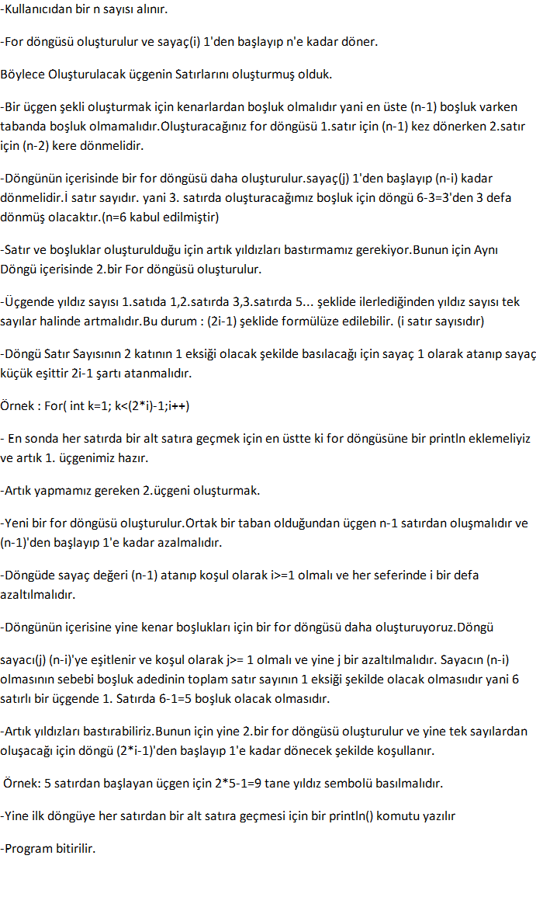

# Patika.dev
Patika.dev Profil : https://app.patika.dev/cans06

# Ödev - Java'da döngüler kullanarak yıldızlar ile elmas Yapımı.
Elmas temel olarak tepe noktaları zıt yönlerde olan ,ortak tabana sahip 2 üçgendir.Program bir normal bir zıt yönlü iki üçgen oluşturmalıdır.
## Programın Çalışması 

  
                        